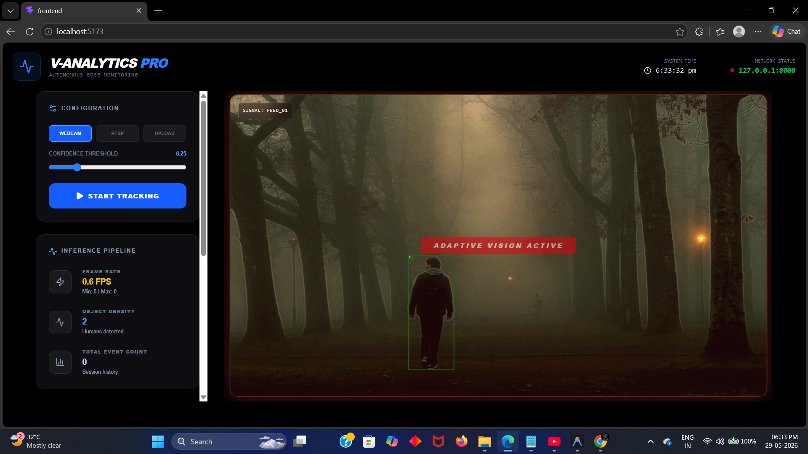
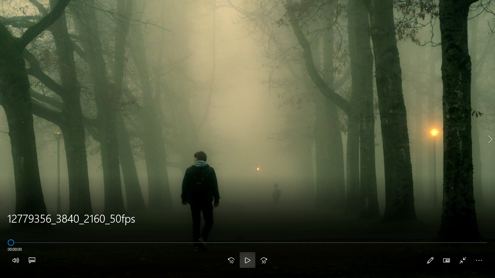
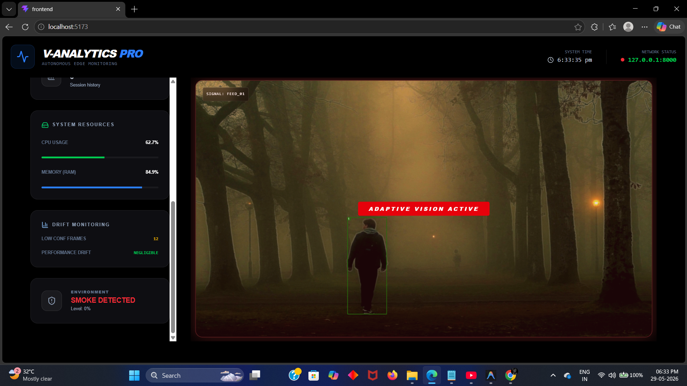
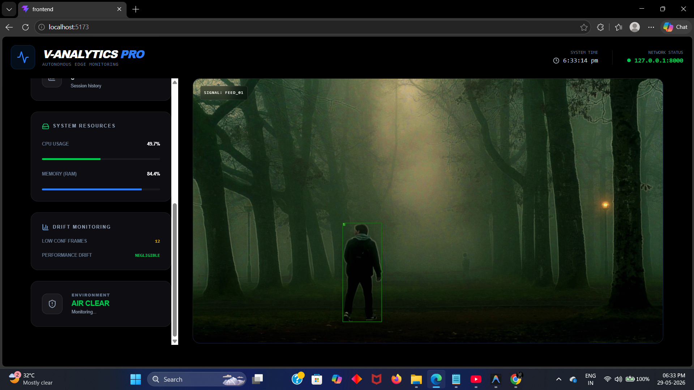
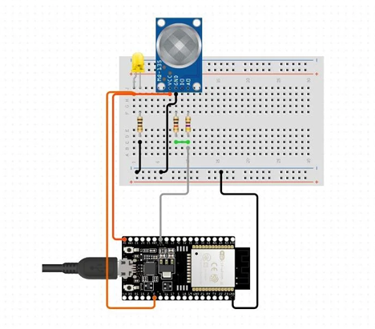
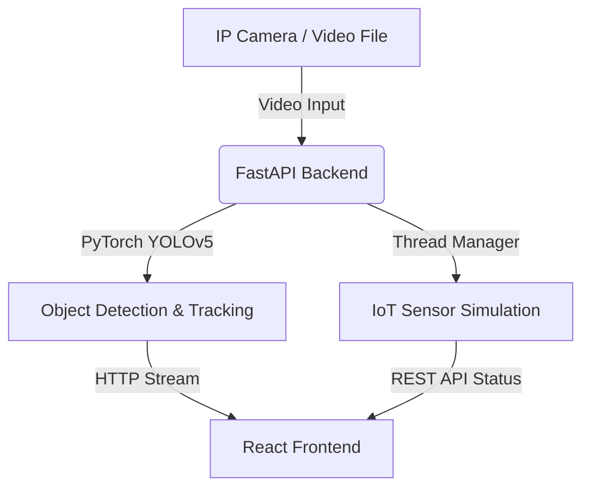

# Video Analytics Pro

A real-time computer vision and IoT analytics platform designed for intelligent monitoring, object detection, and hazard detection (such as smoke and fire). The project features a high-performance **FastAPI (Python) backend** integrated with **YOLOv5 & DeepSORT**, alongside a modern, responsive **React + Vite dashboard** styled with TailwindCSS.

---

## 📸 Screenshots


| Dashboard Overview | Live Video Feed |
| :---: | :---: |
|  |  |

| Real-time Charts | Alert Configurations |
| :---: | :---: |
|  |  |

| Hardware & IoT Setup |
| :---: |
|  |

---

## ✨ Features

- **Real-Time Video Analytics**: Process video streams dynamically using YOLOv5 object detection.
- **Multi-Object Tracking**: Integrates DeepSORT to track individual objects (e.g., humans) frame-by-frame.
- **Smoke & Hazard Detection**: Automated threshold calculations and alert triggers when hazardous smoke/fire is detected.
- **Daemon Thread Sensor Manager**: Simulates/manages physical IoT sensor inputs in a concurrent background thread.
- **High-Performance Stream**: Video streaming served over HTTP multipart boundary frames to the frontend client.
- **Modern Dashboard UI**: 
  - Framer Motion micro-animations for interactions.
  - Interactive charts via Recharts visualizing detection trends.
  - Smooth glassmorphism styled panels.

---

## 🛠️ Architecture



---

## 🚀 Setup & Installation

### Backend (Python FastAPI)

1. Navigate to the backend directory:
   ```bash
   cd backend
   ```

2. Create and activate a virtual environment:
   ```bash
   python -m venv .venv
   # On Windows (PowerShell)
   .\.venv\Scripts\Activate.ps1
   # On Linux/macOS
   source .venv/bin/activate
   ```

3. Install the dependencies:
   ```bash
   pip install -r requirements.txt fastapi uvicorn
   ```

4. Start the server:
   ```bash
   uvicorn backend.main:app --reload
   ```
   The backend will be running at `http://127.0.0.1:8000`.

---

### Frontend (React + Vite)

1. Navigate to the frontend directory:
   ```bash
   cd frontend
   ```

2. Install dependencies:
   ```bash
   npm install
   ```

3. Start the development server:
   ```bash
   npm run dev
   ```
   The frontend will be running at `http://localhost:5173`.

---

## 📡 API Endpoints

- `GET /status` - Retrieves current system metrics (smoke level, CPU usage, human count, etc.).
- `POST /configure` - Dynamically updates detection parameters (confidence threshold, source path, tracking toggle).
- `POST /upload` - Uploads a new video file to process.
- `GET /video_feed` - Live MJPEG video stream showing bounding boxes and tracking IDs.

---

## 🛡️ License

This project is licensed under the MIT License - see the LICENSE file for details.
